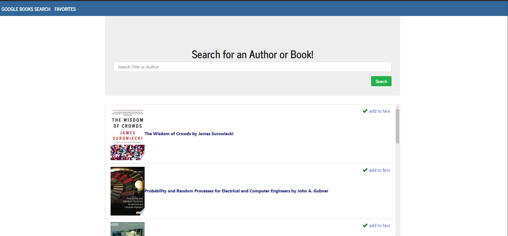
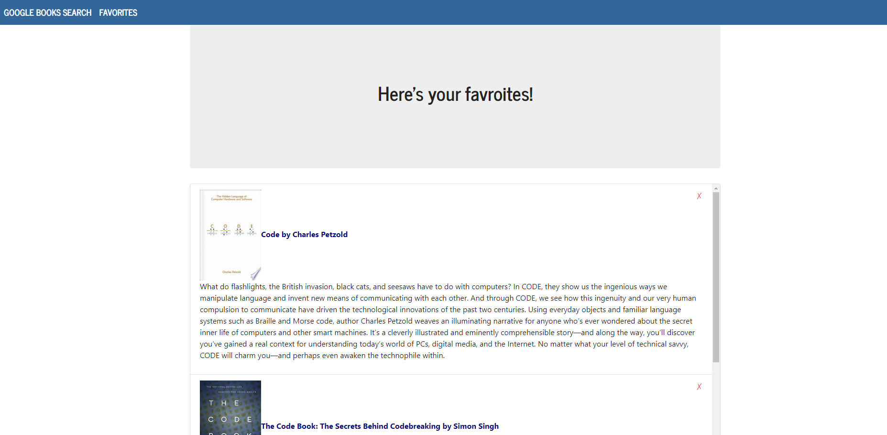

# GoogleBooks

 - ### GitHub Link: https://github.com/greysonkirk/GoogleBooks
 - ### Heroku Link: https://blooming-ocean-39137.herokuapp.com/

This React app allows users to search the Google Books API to find and save their favorite books. 
Their favorite books are then saved to MongoDB and displayed on the favorites page. 

Technologies Used:
- React
- MongoDB
- Express

